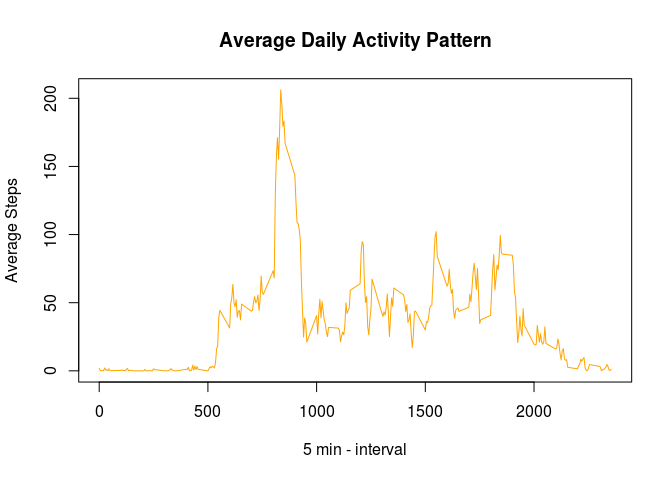

# Reproducible Research: Peer Assessment 1


## Loading data  

```r
## Load required libraries
library(dplyr)
```

```
## 
## Attaching package: 'dplyr'
## 
## The following object is masked from 'package:stats':
## 
##     filter
## 
## The following objects are masked from 'package:base':
## 
##     intersect, setdiff, setequal, union
```

```r
library(ggplot2)
library(scales)

## Extract file
unzip('activity.zip')


data <- read.csv("activity.csv")  

## Check data structure
str(data)  
```

```
## 'data.frame':	17568 obs. of  3 variables:
##  $ steps   : int  NA NA NA NA NA NA NA NA NA NA ...
##  $ date    : Factor w/ 61 levels "2012-10-01","2012-10-02",..: 1 1 1 1 1 1 1 1 1 1 ...
##  $ interval: int  0 5 10 15 20 25 30 35 40 45 ...
```

The variables included in this dataset are:  

  * steps: Number of steps taking in a 5-minute interval (missing values are coded as NA)
  * date: The date on which the measurement was taken in YYYY-MM-DD format
  * interval: Identifier for the 5-minute interval in which measurement was taken

## Processing data:
Date column is a factor variable, we need first to change it to date data type:  

```r
data$date <- as.Date(data$date)  
# Check date column change:
str(data)  
```

```
## 'data.frame':	17568 obs. of  3 variables:
##  $ steps   : int  NA NA NA NA NA NA NA NA NA NA ...
##  $ date    : Date, format: "2012-10-01" "2012-10-01" ...
##  $ interval: int  0 5 10 15 20 25 30 35 40 45 ...
```

## What is mean total number of steps taken per day?  
### 1. Calculate the total number of steps taken per day

```r
## Remove na values  
dataComplete <- data[complete.cases(data),]
# Check removal of na values
str(dataComplete)
```

```
## 'data.frame':	15264 obs. of  3 variables:
##  $ steps   : int  0 0 0 0 0 0 0 0 0 0 ...
##  $ date    : Date, format: "2012-10-02" "2012-10-02" ...
##  $ interval: int  0 5 10 15 20 25 30 35 40 45 ...
```

```r
steps_per_day <- dataComplete %>%  
           group_by(date) %>%  
           summarise(dailyTotal=sum(steps,na.rm=FALSE))
```

### 2. Make a histogram of the total number of steps taken each day

```r
hist(steps_per_day$dailyTotal, 
     main="Histogram of total number of steps per day", 
     xlab="Total number of steps in a day", 
     breaks=31,
     col="orange")  
```

 

### 3. Calculate and report the mean and median of the total number of steps taken per day:  

```r
summary(steps_per_day$dailyTotal)[3:4]
```

```
## Median   Mean 
##  10760  10770
```

```r
mean <- mean(steps_per_day$dailyTotal)  
median <- median(steps_per_day$dailyTotal)  
```


## What is the average daily activity pattern?
### 1. Make a time series plot (i.e. type = "l") of the 5-minute interval (x-axis) and the average number of steps taken, averaged across all days (y-axis)

```r
steps_time <- dataComplete %>%
           group_by(interval) %>%
           summarise(StepsInterval=mean(steps,na.rm=TRUE))
with(steps_time, plot(interval,StepsInterval,
                    type="l",
                    col="orange",
                    main="Average Daily Activity Pattern",
                    xlab="5 min - interval",
                    ylab="Average Steps")
   )
```

 

### 2. Which 5-minute interval, on average across all the days in the dataset, contains the maximum number of steps?

```r
with(steps_time,interval[which.max(StepsInterval)])
```

```
## [1] 835
```
(Equals to 08:35)


## Imputing missing values
### 1.  Calculate and report the total number of missing values in the dataset (i.e. the total number of rows with NAs)  

```r
nrow(data[is.na(data$steps),])
```

```
## [1] 2304
```

### 2. Devise a strategy for filling in all of the missing values in the dataset.
### 3. Create a new dataset that is equal to the original dataset but with the missing data filled in.


```r
# copy original dataset  
data_na_replaced <-data  

# replace NA values with mean steps for that time interval  
data_na_replaced$steps[is.na(data_na_replaced$steps)]<-steps_time$StepsInterval  
```

### 4.1 Make a histogram of the total number of steps taken each day.

```r
# calculate total number steps per day of imputed data 
agg <-aggregate(steps ~ date, data_na_replaced, sum)  

# plot a histogram comparison
par(mfrow = c(1,2))
hist(agg$steps, 
     main= "Missing values imputed",
     xlab="Steps", 
     breaks=31,
     col="yellow")
hist(steps_per_day$dailyTotal,
     main="Original data", 
     xlab="Steps",
     breaks=31,
     col="orange")  
```

 

### 4.2  Calculate and report the mean and median total number of steps taken per day.

```r
summary(agg$steps)[3:4]
```

```
## Median   Mean 
##  10770  10770
```

```r
newMean <- mean(agg$steps)
newMedian <- median(agg$steps)
```

### 4.3 Do these values differ from the estimates from the first part of the assignment?  

```r
diffMean = mean - newMean
diffMedian = median - newMedian
print(diffMean)
```

```
## [1] 0
```

```r
print(diffMedian)
```

```
## [1] -1.188679
```
### 4.4 What is the impact of imputing missing data on the estimates of the total daily number of steps?  
The mean has not changed, the median is slightly larger because new data has been added for missing days not previously calculated.


## Are there differences in activity patterns between weekdays and weekends?  
### 1. Create a new factor variable in the dataset with two levels – “weekday” and “weekend” indicating whether a given date is a weekday or weekend day.  

```r
data_na_replaced <- data_na_replaced %>%  
        mutate(days = ifelse(
                weekdays(date) %in% c("Saturday","Sunday"), "weekend",
                "weekday")
               )

data_na_replaced$days <- as.factor(data_na_replaced$days)

# Check new dataset:
str(data_na_replaced)
```

```
## 'data.frame':	17568 obs. of  4 variables:
##  $ steps   : num  1.717 0.3396 0.1321 0.1509 0.0755 ...
##  $ date    : Date, format: "2012-10-01" "2012-10-01" ...
##  $ interval: int  0 5 10 15 20 25 30 35 40 45 ...
##  $ days    : Factor w/ 2 levels "weekday","weekend": 1 1 1 1 1 1 1 1 1 1 ...
```

### 2. Make a panel plot containing a time series plot (i.e. type = “l”) of the 5-minute interval (x-axis) and the average number of steps taken, averaged across all weekday days or weekend days (y-axis).  

Create plot:

```r
new_plot <- data_na_replaced %>%  
        group_by(days,interval) %>%  
        summarise(total=mean(steps))

g <- ggplot(new_plot, aes(interval,total))
g + geom_line() + 
        facet_wrap(~ days, nrow=2, ncol=1) + 
        labs(y = "Number of Steps") + 
        labs(title = "Weekdays vs. Weekends")
```

 
